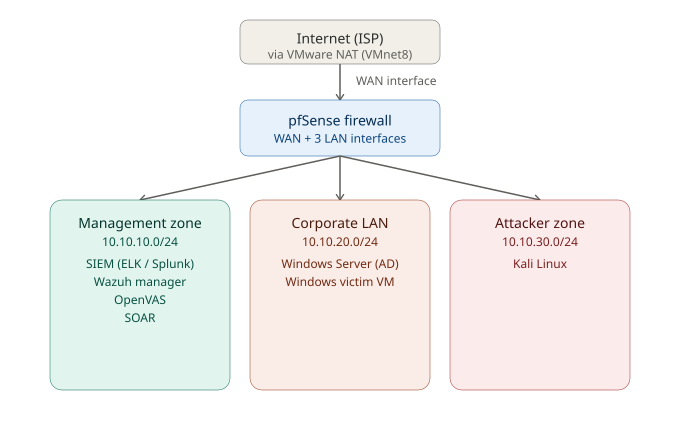

## PHASE 2 — Design

**Goal:** Design the network and naming scheme on paper before building anything.

### 2.1 Network Zones

Enterprise SOCs separate networks into zones so an attacker in one zone can't freely reach another. You'll simulate this with VMware's **virtual networks** (VMnet) and pfSense as the router between them.

*Internet reaches pfSense's WAN interface, which routes out to three isolated LAN interfaces — one per zone below.*

| Zone | VMware Network | Subnet | Who lives here |
|---|---|---|---|
| WAN (simulated internet) | NAT (VMnet8) | Reserved DHCP lease | pfSense's WAN interface only |
| Management | Host-only (VMnet1) | 10.10.10.0/24 | SIEMs, Wazuh, OpenVAS, SOAR, management endpoint — the tools *you* use |
| Corporate LAN | Host-only (VMnet2) | 10.10.20.0/24 | Windows Server (AD), Windows victim VM |
| Attacker Zone | Host-only (VMnet3) | 10.10.30.0/24 | Kali |

pfSense gets one virtual network adapter per zone (4 total) and acts as the router/firewall between all of them — this is exactly how a real network's edge firewall works, just scaled down.

### 2.2 VM Inventory & IP Address Plan

This is the authoritative, as-built reference — kept in sync with actual builds, not just the original plan.

| VM Name | Rolee | RAM | vCPU | Disk | IP Address | OS |
|---|---|---|---|---|---|---|
| SOC-FW-pfSense | Firewall/router | 2GB | 2 | 20GB | WAN: reserved DHCP lease (`10.10.40.101`) · Mgmt: `10.10.10.5/24` · Corp: `10.10.20.5/24` · Attacker: `10.10.30.5/24` | FreeBSD |
| SOC-atk-Kali | Attacker | 2GB | 2 | 40GB | `10.10.30.10/24` | Kali 2026-1 |
| SOC-Vict-Win10 | Corp victim | 4GB | 2 | 60GB | `10.10.20.20/24` | Windows 10 |
| SOC-ADSRV-Win19 | Domain Controller | 4GB | 2 | 60GB | `10.10.20.10/24` | Windows Server 2019 Standard (not activated) |
| SOC-SIEM-ELK | SIEM #1 | 4GB | 4 | 60GB | `10.10.10.10/24` | Ubuntu 24.04 |
| SOC-SIEM-Splunk | SIEM #2 | 6GB | 2 | 60GB | `10.10.10.14/24` | Ubuntu 24.04 |
| SOC-XDR-Wazuh | HIDS/XDR | 4GB | 2 | 40GB | `10.10.10.11/24` | Ubuntu 24.04 |
| SOC-Vuln-OpenVAS | Vulnerability scanner | 6GB | 2 | 40GB | `10.10.10.12/24` | Ubuntu 24.04 |
| *SOC-SOAR-Shuffle (planned)* | SOAR | 4GB (planned) | 2 (planned) | 40GB (planned) | `10.10.10.13/24` | Ubuntu 24.04 (planned) |
| *Management Endpoint (planned)* | Analyst workstation | — | — | — | `10.10.10.15/24` | KDE Linux (planned) |

> **Notes on deviations from the original plan:** pfSense's WAN is a **reserved DHCP lease** (`10.10.40.101`), not a plain dynamic address — worth knowing if it ever needs to be reconfirmed after a host reboot. ELK ended up built with **more vCPU, less RAM** than originally planned (4 vCPU / 4GB vs. the planned 2 vCPU / 8GB) — running without errors as-is. OpenVAS ended up with **more RAM** than planned (6GB vs. 4GB). pfSense's LAN interface addresses were changed from `.1` to `.5` on each subnet — every VM's default gateway and DNS server should point at the `.5` address on its zone. **SIEM ELK and Splunk both run permanently side by side** rather than swapping in one at a time, since the pod strategy in Phase 1 assumed only one would run at once — see that phase's updated RAM math. **Wazuh was rebuilt from scratch on Ubuntu 24.04**, replacing an earlier build on Wazuh's official OVA (Amazon Linux 2023) that was abandoned after integration difficulties — different base OS from the rest of the lab caused build steps to assume the wrong package manager, and the OVA's bundled Filebeat conflicted with the log-forwarding setup. See [Configure Log Forwarding](configure-log-forwarding.md) for the full story. Wazuh now matches every other Linux VM in the lab (Ubuntu 24.04), removing that whole class of problem going forward.

### 2.3 Data Flow Design

Attack traffic path: **Kali (10.10.30.10) → pfSense → Windows victim (10.10.20.20)**
Detection path: **Windows victim (Wazuh agent) + pfSense (IDS) → logs forwarded → SIEM (10.10.10.10)**
Response path: **SIEM alert → SOAR → automated action back on Windows Server/victim**

### 2.4 Naming Convention

Use a consistent prefix so VMs are easy to identify in VMware's library: `SOC-<role>-<os>`, e.g. `SOC-FW-pfSense`, `SOC-SIEM-ELK`, `SOC-Vict-Win10`, `SOC-atk-Kali`, `SOC-ADSRV-Win19`, `SOC-XDR-Wazuh`, `SOC-Vuln-OpenVAS` — see the inventory table in 2.2 for the full current list.

### Exit Criteria for Phase 2

- [ ] Network diagram (zones + subnets) written down
- [ ] IP address table completed
- [ ] Naming convention chosen
